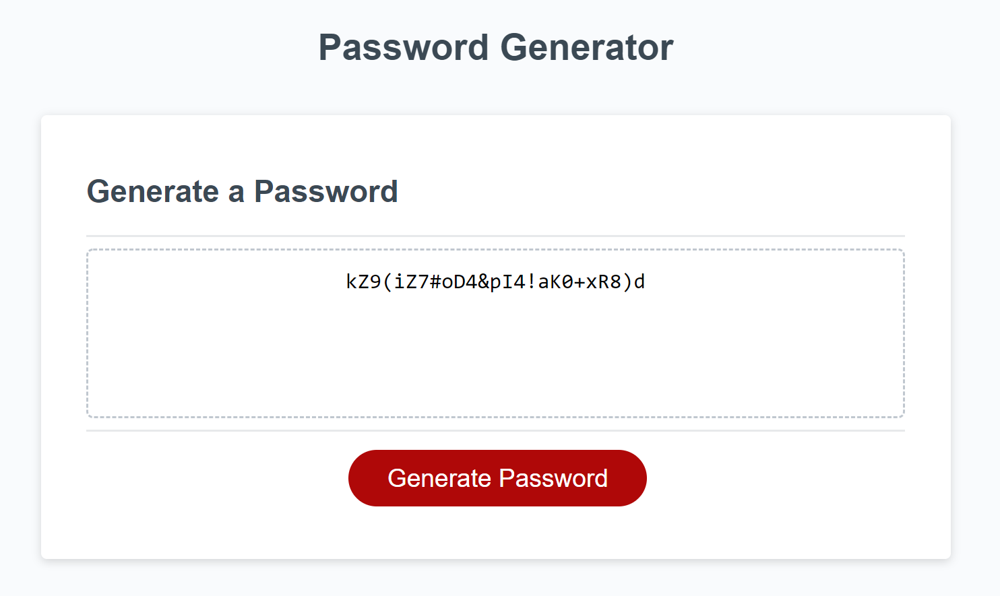

# Week03-PasswordGenerator

A password generator with prompts and validations

## Expected Behavior

* Prompt user for the length of the password

* Check if they want lowercase

* Check if they want uppercase

* Check if they want numerics

* Check if they want special characters

* Insure user choices are valid and at least one character option was selected

* Generate the password

## Link to deployed application

[GitHub](https://fett-boba.github.io/Week03-PasswordGenerator/) https://fett-boba.github.io/Week03-PasswordGenerator/

## Assests

---